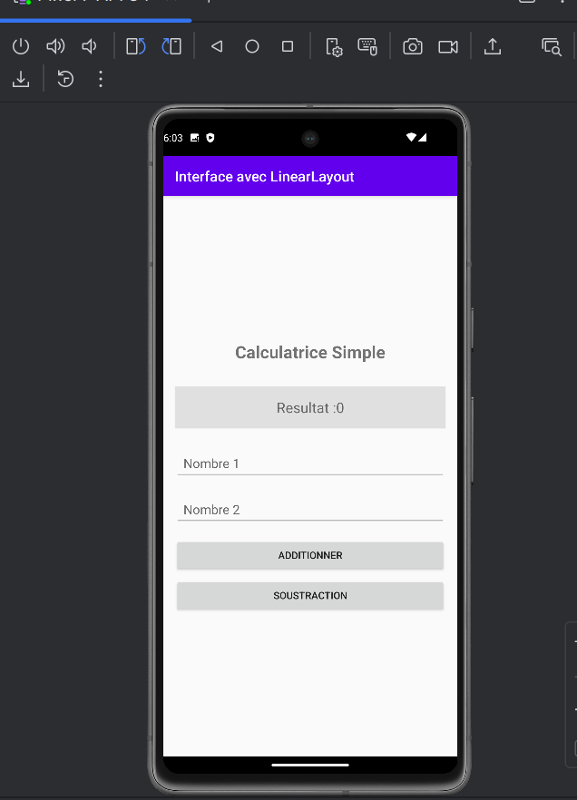
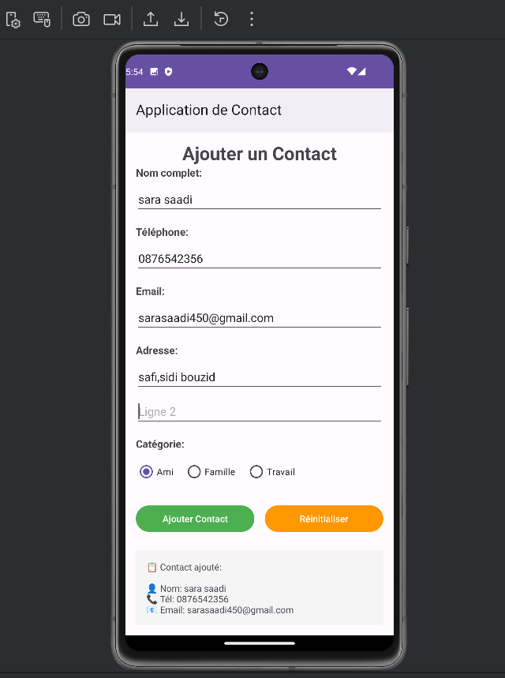

# Atelier Android - Interfaces Utilisateur

## 👤 Étudiant
- **Nom :** Sara Saadi
- **Date :** 10/ 11 / 2025

---

## 📱 Exercices réalisés

### 🧮 Exercice 1 : Calculatrice (LinearLayout)
- ✅ Interface réalisée avec **LinearLayout**
- ✅ Fonctionnalités d’**addition** et de **soustraction**
- ✅ Vérification des entrées avec **Toast** pour les erreurs
- ✅ Bonne organisation du code (binding, événements, fonctions)

### 👤 Exercice 2 : Profil Utilisateur (ConstraintLayout)
- ✅ Interface conçue avec **ConstraintLayout**
- ✅ Formulaire de profil avec nom, email et téléphone
- ✅ Mise à jour dynamique des informations
- ✅ Affichage des messages de validation

### 🏆 Challenge : Application de Contact
- ✅ Formulaire complet avec nom, téléphone, email et adresse
- ✅ Catégories avec **RadioButtons** (Ami, Famille, Travail)
- ✅ Validation des champs
- ✅ Affichage formaté du contact ajouté
- ✅ Fonction de **réinitialisation** du formulaire

---

## 🖼 Captures d’écran

### Calculatrice

### Profil Utilisateur

### Application de Contact

---

## 📚 Ce que j’ai appris
- Comprendre la différence entre **LinearLayout** et **ConstraintLayout**
- Utiliser les **contraintes** pour créer des interfaces responsives
- Manipuler les **vues Android** avec `findViewById()`
- Gérer les événements avec `setOnClickListener()`
- Créer une **application Android complète** avec validation et feedback utilisateur
- Publier un projet sur **GitHub**

---

## 💡 Difficultés rencontrées
- Comprendre le positionnement des éléments avec **ConstraintLayout**  
  → Résolu grâce au **Layout Editor** et à l’ajout de contraintes Top/Bottom/Start/End
- Erreurs “Unresolved reference” lors du binding  
  → Résolu en vérifiant les **ID XML** et en reconstruisant le projet
- Problèmes de validation de formulaire  
  → Corrigé en ajoutant des vérifications `.isEmpty()` et des **Toast**

---
